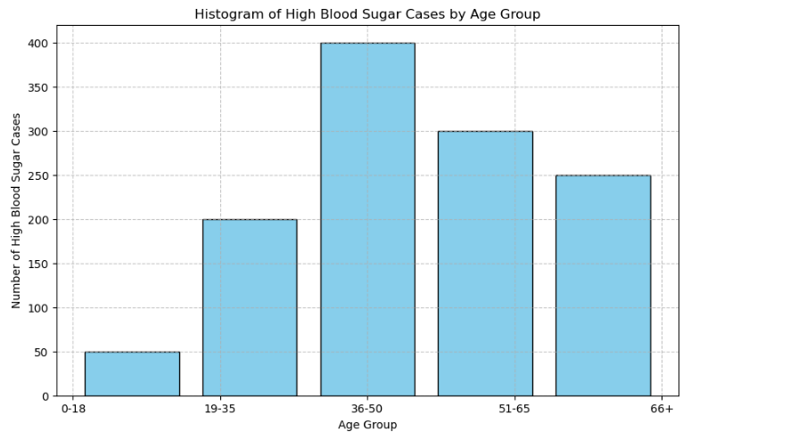
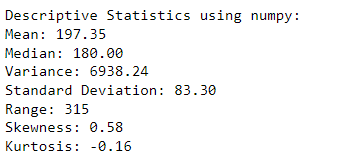

# Project4-STM-Analysis-of-High-Blood-Sugar-Population
> **Brief Description:** Statistical analysis of Diabetic population in a specific region

---

## Table of Contents

- [Description](#description)
- [Video Explanation](#video)
- [Technologies Used](#technologies-used)
- [Dataset](#dataset)
- [Program Codes ](#program-codes)
- [Screenshots](#screenshots)
- [Contribution](#contributipn)
- [Contact Details](#contact-details)

---

## Description

Assessment of blood sugar level of a population of a town. Histogram showing Agewise Distrbution of High Blood Sugar among the population and another histogram showing frequency distribution of High Blood Sugar population by their levels

## Video
<!--
 
-->

We are working on this section. Please check at some other time.

## Technologies-used

Python programming language, pandas and matplotlib package.

## Dataset

The data set is synthetically generated and used for demonstrating the concept only. The program can be easily modified to show results with real readings taken from the patients.

## Program-codes

The programs are written on jupiter notebook, You may run the program on Google colab by clicking on the colab badge below.

## Screenshots

The program generates and plots a histogram to illustrate the distribution of high blood sugar cases across different age groups. Here's what the plot communicates in layman's terms:

### Plot Overview:
**Histogram:**
- The histogram shows the number of high blood sugar cases in various age groups.

### Key Points:
**Age Groups:**
- The x-axis represents different age groups: '0-18', '19-35', '36-50', '51-65', and '66+'.
- Each age group is mapped to a numerical bin for plotting purposes.

**High Blood Sugar Cases:**
- The y-axis represents the number of high blood sugar cases.
- The height of each bar corresponds to the number of cases in each age group.

### Interpretation:
**Distribution of Cases:**
- The histogram shows how high blood sugar cases are distributed across different age groups.
- For example, the tallest bar indicates the age group with the highest number of cases.

### In Layman's Terms:
The plot visually explains how many people in different age groups have high blood sugar. Each bar represents an age group, and the height of the bar shows the number of people with high blood sugar in that group. For instance, if the bar for the '36-50' age group is the tallest, it means that the most cases of high blood sugar are found in people aged 36-50. This helps to understand which age groups are more affected by high blood sugar.

The program generates and plots a histogram to illustrate the distribution of high blood sugar readings in a population, along with key descriptive statistics. Here's what the plot communicates in layman's terms:

### Plot Overview:
1. **Histogram**:
   - The histogram shows the frequency of high blood sugar readings in various ranges.
   - It includes lines for the central point of the normal blood sugar range and the mean of the sample readings.

### Key Points:
1. **Blood Sugar Readings**:
   - The x-axis represents different blood sugar levels in mg/dL.
   - The y-axis represents the frequency of readings within each range.

2. **Descriptive Statistics**:
   - **Mean (Average)**: The average blood sugar level of the sample.
   - **Median**: The middle value when the readings are sorted.
   - **Variance**: A measure of how spread out the readings are.
   - **Standard Deviation**: Another measure of the spread or variability of the readings.
   - **Range**: The difference between the highest and lowest readings.
   - **Skewness**: Indicates the asymmetry of the distribution (positive skew means more readings are on the lower end).
   - **Kurtosis**: Indicates the "tailedness" of the distribution (higher kurtosis means more readings are in the tails).

3. **Central Point**:
   - A red dashed line represents the central point for the normal blood sugar range (e.g., 100 mg/dL).

4. **Mean Reading**:
   - A green dashed line represents the mean blood sugar level of the sample.

### Interpretation:
- **Distribution of Readings**:
  - The histogram shows how often different blood sugar levels occur in the sample.
  - The position of the mean and central point lines helps to see where the majority of the readings fall concerning the normal range.

- **Variability and Skewness**:
  - The spread of the bars indicates the variability in blood sugar readings.
  - If most bars are to the right of the central point, it indicates higher readings than the normal range.

### In Layman's Terms:
The plot visually explains how blood sugar levels are distributed among a group of people. Each bar shows how many people have blood sugar levels within a specific range. The red dashed line represents the normal blood sugar level (100 mg/dL), and the green dashed line shows the average blood sugar level of the group.

- If the green line (mean) is much higher than the red line (normal range center), it means that, on average, people's blood sugar levels are higher than normal.
- The spread of the bars (height and width) tells us how varied the blood sugar levels are—whether they are similar across the group or if there is a wide range of different levels.

This plot helps to understand the overall pattern of blood sugar levels in the population and indicates whether most people have higher than normal blood sugar levels, which could be a health concern.

## Contribution

The programs are written by Santanu Karmakar

## Contact-details

If you wish to contact me, please leave a message (Preferably WhatsApp) on this number: 6291 894 897.
Please also mention why you are contacting me. Include your name and necessary details.
Thank you for taking an interest.
